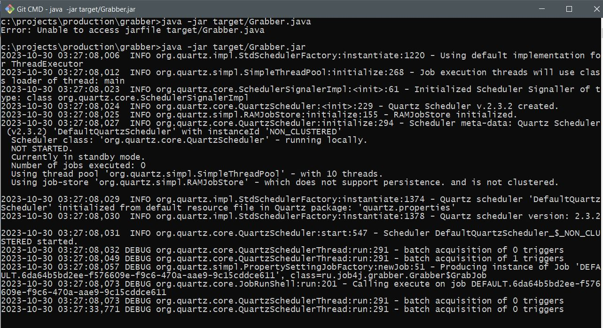
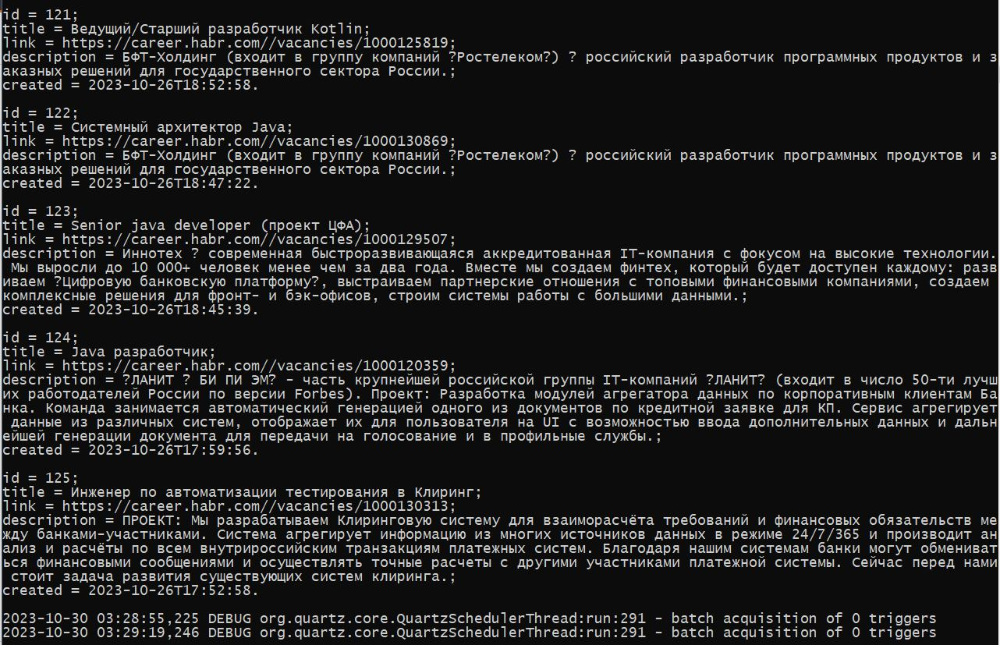
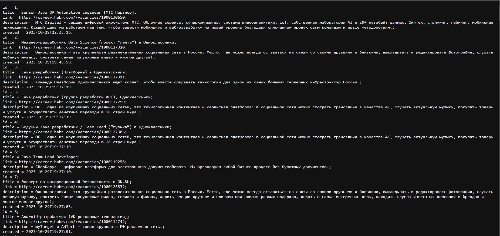

# job4j_grabber
#### Приложение "Агрегатор Java вакансий"
      
[](https://app.travis-ci.com/MasterMaxTs/project_grabber)
[](https://codecov.io/gh/MasterMaxTs/project_grabber)

&nbsp;&nbsp;&nbsp;<br>
&nbsp;&nbsp;&nbsp;<br>
&nbsp;&nbsp;&nbsp;
&nbsp;&nbsp;&nbsp;
&nbsp;&nbsp;&nbsp;
&nbsp;&nbsp;&nbsp;
&nbsp;&nbsp;&nbsp;<br>
&nbsp;&nbsp;&nbsp;
&nbsp;&nbsp;&nbsp;
&nbsp;&nbsp;&nbsp;
&nbsp;&nbsp;&nbsp;<br>
&nbsp;&nbsp;&nbsp;
&nbsp;&nbsp;&nbsp;<br><br>
&nbsp;&nbsp;&nbsp;


### Это проект по разработке приложения "Агрегатор Java вакансий".

___
### Требуемый функционал.
<br>

1. <b>Программа считывает с двух сайтов все вакансии, относящиеся к Java, и записывает их в базу данных.</b><br><br>
   - Адрес страницы сайта №1: 
    >    https://career.habr.com/vacancies/java_developer
   - Адрес страницы сайта №2:
    >    https://www.sql.ru/forum/job-offers/

<br>   

2. <b>Программа использует планировщик для запуска по расписанию</b>
   - Период запуска указывается в файле настройки приложения <em>app.properties.</em>
   - События исполнения программы записываются логгером и выводятся в консоль.

<br>   

3. <b>Результат выполнения программы выводится в консоль, так же предусмотрен вывод в виде html-страницы.</b>


<br>   

4. <b>Расширение.</b>
   - В проект можно добавить новые сайты без изменения кода. 
   - В проекте можно сделать параллельный парсинг сайтов.

<br>

---
### Стек технологий
<br>

- Java 11
- Maven 3.6.3
- Quartz-scheduler v.2.3.2
- Jsoup v.1.14.3
- Log4j v.1.2.17
- Slf4j-log4j12 v.1.7.32
- СУБД: PostgreSQL v.14.0.
  <br><br>
- Тестирование:
    - JUnit v.4.13.2
    - Hamcrest v.1.3

<br>

- Упаковка проекта: Java Archive (.jar)

---
### Требования к окружению
<br>

- Java 11
- Maven v.3.6.3
- PostgreSQL v.14.0

<br>

---
### Запуск проекта
<br>

1. Установить СУБД PostgreSQL


2. Создать базу данных с именем grabber:<br>
   ```create database grabber;```


3. Скачать файлы проекта с github по ссылке и разархивировать в выбранную директорию:<br>
   [https://github.com/MasterMaxTs/project_grabber/archive](https://github.com/MasterMaxTs/project_grabber/archive/refs/heads/master.zip)


4. Перейти в директорию проекта, открыть командную строку.</br>
   - Для <ins>первого</ins> запуска приложения выполнить последовательно команды:
     - ```mvn package -Dmaven.test.skip=true```
     - ```java -jar target/Grabber.jar```

   - Для <ins>последующего</ins> запуска приложения выполнять команду:
     - ```java -jar target/Grabber.jar```


5. Список найденных вакансий выводится в консоль, также доступен просмотр через веб-интерфейс по адресу:
   - ```localhost:9000```


---
### Закрытие проекта
<br>

- Закрыть окно командной строки

<br>

---
### Взаимодействие с приложением
<br>

1. Вид в консоли при старте приложения:<br><br>
   


2. Вид консоли работающего приложения:<br><br>
   


3. Вид страницы с найденными при помощи приложения вакансиями в браузере:<br><br>
   


___
### Контакты

* Email: java.dev-maxim.tsurkanov@yandex.ru
* Skype: https://join.skype.com/invite/ODADx0IJ3BBu
* VK: https://m.vk.com/id349328153
* Telegram: matsurkanov
